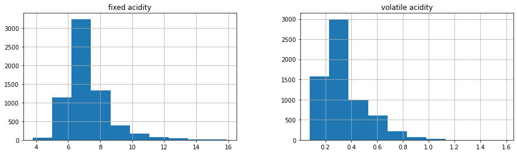
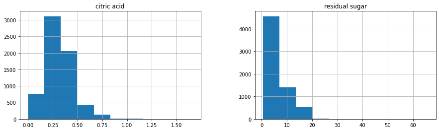
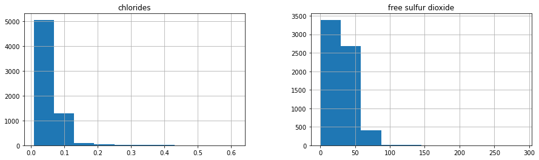
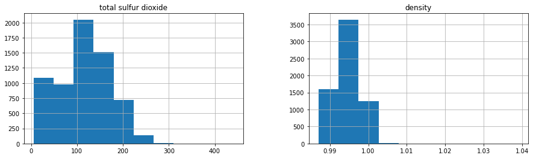
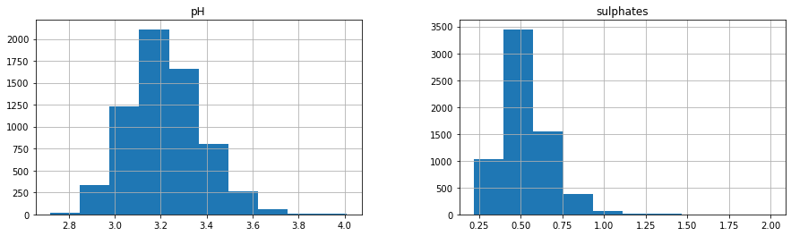
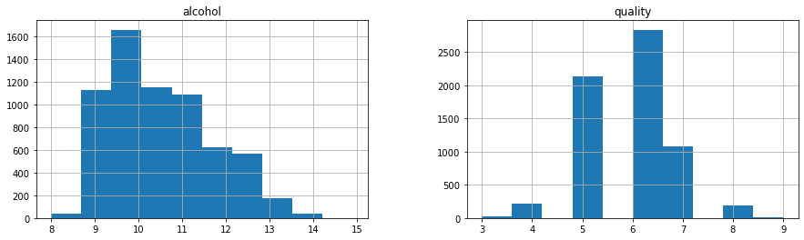
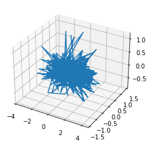

```python
import numpy as np
import pandas as pd
import matplotlib.pyplot as plt
%matplotlib inline
from sklearn.model_selection import train_test_split
from sklearn.pipeline import Pipeline
from sklearn.preprocessing import StandardScaler, MinMaxScaler
from sklearn.linear_model import LinearRegression
from sklearn.ensemble import RandomForestRegressor
from sklearn.decomposition import PCA, KernelPCA
```

    <frozen importlib._bootstrap>:219: RuntimeWarning: numpy.ufunc size changed, may indicate binary incompatibility. Expected 192 from C header, got 216 from PyObject


```python
ds = pd.read_csv('/HDD/Data/winequalityN.csv')
```


```python
ds.head()
```


<div>
<style scoped>
    .dataframe tbody tr th:only-of-type {
        vertical-align: middle;
    }

    .dataframe tbody tr th {
        vertical-align: top;
    }

    .dataframe thead th {
        text-align: right;
    }
</style>
<table border="1" class="dataframe">
  <thead>
    <tr style="text-align: right;">
      <th></th>
      <th>type</th>
      <th>fixed acidity</th>
      <th>volatile acidity</th>
      <th>citric acid</th>
      <th>residual sugar</th>
      <th>chlorides</th>
      <th>free sulfur dioxide</th>
      <th>total sulfur dioxide</th>
      <th>density</th>
      <th>pH</th>
      <th>sulphates</th>
      <th>alcohol</th>
      <th>quality</th>
    </tr>
  </thead>
  <tbody>
    <tr>
      <th>0</th>
      <td>white</td>
      <td>7.0</td>
      <td>0.27</td>
      <td>0.36</td>
      <td>20.7</td>
      <td>0.045</td>
      <td>45.0</td>
      <td>170.0</td>
      <td>1.0010</td>
      <td>3.00</td>
      <td>0.45</td>
      <td>8.8</td>
      <td>6</td>
    </tr>
    <tr>
      <th>1</th>
      <td>white</td>
      <td>6.3</td>
      <td>0.30</td>
      <td>0.34</td>
      <td>1.6</td>
      <td>0.049</td>
      <td>14.0</td>
      <td>132.0</td>
      <td>0.9940</td>
      <td>3.30</td>
      <td>0.49</td>
      <td>9.5</td>
      <td>6</td>
    </tr>
    <tr>
      <th>2</th>
      <td>white</td>
      <td>8.1</td>
      <td>0.28</td>
      <td>0.40</td>
      <td>6.9</td>
      <td>0.050</td>
      <td>30.0</td>
      <td>97.0</td>
      <td>0.9951</td>
      <td>3.26</td>
      <td>0.44</td>
      <td>10.1</td>
      <td>6</td>
    </tr>
    <tr>
      <th>3</th>
      <td>white</td>
      <td>7.2</td>
      <td>0.23</td>
      <td>0.32</td>
      <td>8.5</td>
      <td>0.058</td>
      <td>47.0</td>
      <td>186.0</td>
      <td>0.9956</td>
      <td>3.19</td>
      <td>0.40</td>
      <td>9.9</td>
      <td>6</td>
    </tr>
    <tr>
      <th>4</th>
      <td>white</td>
      <td>7.2</td>
      <td>0.23</td>
      <td>0.32</td>
      <td>8.5</td>
      <td>0.058</td>
      <td>47.0</td>
      <td>186.0</td>
      <td>0.9956</td>
      <td>3.19</td>
      <td>0.40</td>
      <td>9.9</td>
      <td>6</td>
    </tr>
  </tbody>
</table>
</div>


```python
ds[['fixed acidity', 'volatile acidity']].hist(figsize=(15,4))
```


    array([[<AxesSubplot:title={'center':'fixed acidity'}>,
            <AxesSubplot:title={'center':'volatile acidity'}>]], dtype=object)


    

    


```python
ds[['citric acid', 'residual sugar']].hist(figsize=(15,4))
```


    array([[<AxesSubplot:title={'center':'citric acid'}>,
            <AxesSubplot:title={'center':'residual sugar'}>]], dtype=object)


    

    


```python
ds[['chlorides', 'free sulfur dioxide']].hist(figsize=(15,4))
```


    array([[<AxesSubplot:title={'center':'chlorides'}>,
            <AxesSubplot:title={'center':'free sulfur dioxide'}>]],
          dtype=object)


    

    


```python
ds[['total sulfur dioxide', 'density']].hist(figsize=(15,4))
```


    array([[<AxesSubplot:title={'center':'total sulfur dioxide'}>,
            <AxesSubplot:title={'center':'density'}>]], dtype=object)


    

    


```python
ds[['pH', 'sulphates']].hist(figsize=(15,4))
```


    array([[<AxesSubplot:title={'center':'pH'}>,
            <AxesSubplot:title={'center':'sulphates'}>]], dtype=object)


    

    


```python
ds[['alcohol', 'quality']].hist(figsize=(15,4))
```


    array([[<AxesSubplot:title={'center':'alcohol'}>,
            <AxesSubplot:title={'center':'quality'}>]], dtype=object)


    

    


## Prepare the data


```python
ds = ds.dropna()
ds.dtypes
```


    type                     object
    fixed acidity           float64
    volatile acidity        float64
    citric acid             float64
    residual sugar          float64
    chlorides               float64
    free sulfur dioxide     float64
    total sulfur dioxide    float64
    density                 float64
    pH                      float64
    sulphates               float64
    alcohol                 float64
    quality                   int64
    dtype: object


```python
y = ds.quality.values
X = pd.get_dummies(ds.drop('quality', axis=1))
X.head()
```


<div>
<style scoped>
    .dataframe tbody tr th:only-of-type {
        vertical-align: middle;
    }

    .dataframe tbody tr th {
        vertical-align: top;
    }

    .dataframe thead th {
        text-align: right;
    }
</style>
<table border="1" class="dataframe">
  <thead>
    <tr style="text-align: right;">
      <th></th>
      <th>fixed acidity</th>
      <th>volatile acidity</th>
      <th>citric acid</th>
      <th>residual sugar</th>
      <th>chlorides</th>
      <th>free sulfur dioxide</th>
      <th>total sulfur dioxide</th>
      <th>density</th>
      <th>pH</th>
      <th>sulphates</th>
      <th>alcohol</th>
      <th>type_red</th>
      <th>type_white</th>
    </tr>
  </thead>
  <tbody>
    <tr>
      <th>0</th>
      <td>7.0</td>
      <td>0.27</td>
      <td>0.36</td>
      <td>20.7</td>
      <td>0.045</td>
      <td>45.0</td>
      <td>170.0</td>
      <td>1.0010</td>
      <td>3.00</td>
      <td>0.45</td>
      <td>8.8</td>
      <td>0</td>
      <td>1</td>
    </tr>
    <tr>
      <th>1</th>
      <td>6.3</td>
      <td>0.30</td>
      <td>0.34</td>
      <td>1.6</td>
      <td>0.049</td>
      <td>14.0</td>
      <td>132.0</td>
      <td>0.9940</td>
      <td>3.30</td>
      <td>0.49</td>
      <td>9.5</td>
      <td>0</td>
      <td>1</td>
    </tr>
    <tr>
      <th>2</th>
      <td>8.1</td>
      <td>0.28</td>
      <td>0.40</td>
      <td>6.9</td>
      <td>0.050</td>
      <td>30.0</td>
      <td>97.0</td>
      <td>0.9951</td>
      <td>3.26</td>
      <td>0.44</td>
      <td>10.1</td>
      <td>0</td>
      <td>1</td>
    </tr>
    <tr>
      <th>3</th>
      <td>7.2</td>
      <td>0.23</td>
      <td>0.32</td>
      <td>8.5</td>
      <td>0.058</td>
      <td>47.0</td>
      <td>186.0</td>
      <td>0.9956</td>
      <td>3.19</td>
      <td>0.40</td>
      <td>9.9</td>
      <td>0</td>
      <td>1</td>
    </tr>
    <tr>
      <th>4</th>
      <td>7.2</td>
      <td>0.23</td>
      <td>0.32</td>
      <td>8.5</td>
      <td>0.058</td>
      <td>47.0</td>
      <td>186.0</td>
      <td>0.9956</td>
      <td>3.19</td>
      <td>0.40</td>
      <td>9.9</td>
      <td>0</td>
      <td>1</td>
    </tr>
  </tbody>
</table>
</div>


```python
pipeline = Pipeline([
    ('normalizer', StandardScaler()),
    ('scaler', MinMaxScaler())
])
pipeline.fit(X)
```


    Pipeline(steps=[('normalizer', StandardScaler()), ('scaler', MinMaxScaler())])


```python
X = pipeline.transform(X)
```

### Playground zone


```python
kpca = KernelPCA(n_components=13)
pca = PCA(n_components=13)

X_pca = pca.fit_transform(X)
X_kpca = kpca.fit_transform(X)

```


```python
X_train, X_test, y_train, y_test = train_test_split(X, y, test_size=0.2)
print(f'X_train {X_train.shape}\nX_test {X_test.shape}\ny_train {y_train.shape}\ny_test {y_test.shape}')
```

    X_train (5170, 13)
    X_test (1293, 13)
    y_train (5170,)
    y_test (1293,)


### Models

#### Linear regression


```python
regression = LinearRegression()
regression.fit(X_train, y_train)

predicted = regression.predict(X_test).round()
mse = np.power(predicted - y_test, 2).mean()
correct = (predicted == y_test).sum()/len(y_test)

print(f'MSE\t\t{mse}\nAccuracy\t{correct*100}%')
```

    MSE		0.6403712296983759
    Accuracy	52.2815158546017%


#### Random forest


```python
rfr = RandomForestRegressor()
rfr.fit(X_train, y_train)

predicted = rfr.predict(X_test).round()
mse = np.power(predicted - y_test, 2).mean()
correct = (predicted == y_test).sum()/len(y_test)

print(f'MSE\t\t{mse}\nAccuracy\t{correct*100}%')
```

    MSE		0.4176334106728538
    Accuracy	67.59474091260634%


### Model Storage


```python
from joblib import dump, load
```


```python
mdsl = [
    regression,
    rfr,
]
```


```python
dump(storage['random_forest']['model'], 'randForestRegressor-90.joblib')
```


    ['randForestRegressor-90.joblib']


```python
dump(storage['random_forest']['model'], 'randForestRegressor-70.joblib')
```


    ['randForestRegressor-70.joblib']


```python
print((mdsl[0].predict(X_test).round() == y_test).sum()/len(y_test) * 100)
print((mdsl[1].predict(X_test).round() == y_test).sum()/len(y_test) * 100)
```

    55.60711523588554
    89.79118329466357


```python
dump(mdsl[0], 'linearRegressor-55.joblib')
dump(mdsl[1], 'randForestRegressor-89.joblib')
```


    ['randForestRegressor-89.joblib']


### Final models


```python
rf90 = load('randForestRegressor-90.joblib')
rf70 = load('randForestRegressor-70.joblib')
rf89 = load('randForestRegressor-89.joblib')
lr55 = load('linearRegressor-55.joblib')
```


```python
print('RF90 ->', (rf90.predict(X_test).round() == y_test).sum()/len(y_test) * 100, '%')
print('RF70 ->', (rf70.predict(X_test).round() == y_test).sum()/len(y_test) * 100, '%')
print('RF89 ->', (rf89.predict(X_test).round() == y_test).sum()/len(y_test) * 100, '%')
print('LR55 ->', (lr55.predict(X_test).round() == y_test).sum()/len(y_test) * 100, '%')
```

    RF90 -> 89.1724671307038 %
    RF70 -> 91.415313225058 %
    RF89 -> 90.02320185614849 %
    LR55 -> 53.209590100541384 %


### Still plaing with the models


```python
class MasterRegressor:
    def __init__(self, *models):
        self.models = models
        self.main = RandomForestRegressor()
    
    def transform_data(self, X):
        virtual_data = np.zeros((len(X), len(self.models)))
        for i, model in enumerate(self.models):
            virtual_data[:,i] = model.predict(X)
        return virtual_data
    
    def fit(self, X, y):
        self.main.fit(self.transform_data(X), y)
    
    def predict(self, X):
        return self.main.predict(self.transform_data(X))
```


```python
final_model = MasterRegressor(rf90, rf70, rf89, lr55)
final_model.fit(X_train, y_train)
```


```python
dump(final_model, 'final_regressor.joblib')
```


    ['final_regressor.joblib']


```python
final_predictions = final_model.predict(X_test).round()

print(f'Final result: {(final_predictions==y_test).sum()/len(y_test) * 100:.2f}% of confidence')
```

    Final result: 97.68% of confidence


```python
from mpl_toolkits.mplot3d import axes3d
import matplotlib.pyplot as plt

tmpData = PCA(n_components=3).fit_transform(final_model.transform_data(X_test))

fig = plt.figure()
ax = fig.add_subplot(111, projection='3d')

ax.plot(tmpData[:,0], tmpData[:,1], tmpData[:,2])
```


    [<mpl_toolkits.mplot3d.art3d.Line3D at 0x7fc45d8e1d30>]


    

    

